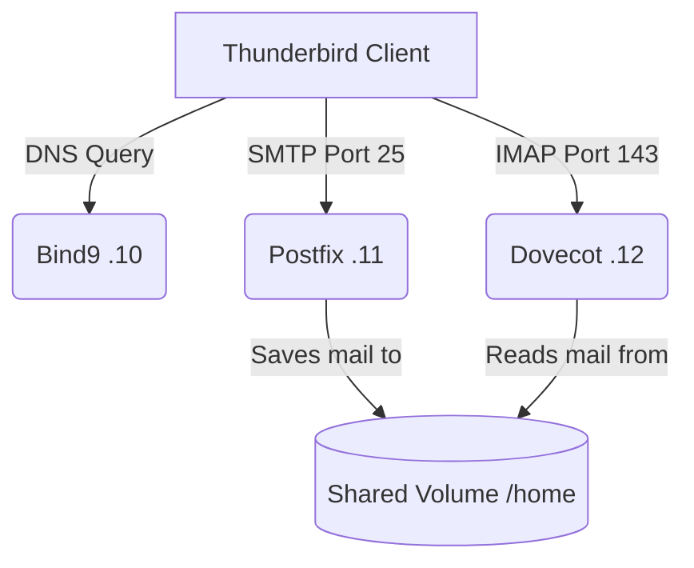

# 🐳 Docker Mail Server Lab (DNS + Postfix + Dovecot)


This project deploys a complete email server infrastructure using **Docker containers**. It simulates a real-world production environment by separating services into distinct containers (DNS, MTA, MDA), interconnected via a private network and shared volumes for data persistence.

## 🏗 Project Architecture

The system consists of 3 main services communicating within the `isrv-net` network (Subnet: `192.168.57.0/24`).

| Service | Hostname | Fixed IP | Role |
| :--- | :--- | :--- | :--- |
| **BIND9** | `ns.isrv.test` | `192.168.57.10` | Authoritative DNS server and name resolution. |
| **Postfix** | `postfix.isrv.test` | `192.168.57.11` | **MTA** (Mail Transfer Agent). Receives emails via SMTP. |
| **Dovecot** | `dovecot.isrv.test` | `192.168.57.12` | **MDA** (Mail Delivery Agent). Serves emails via IMAP/POP3. |

---

### Data Flow Diagram



## 🚀 Quick Deployment

### Prerequisites

* Docker and Docker Compose installed.
* Ports 53, 25, 143, and 110 must be free on your host machine (or port mapping must be adjusted).

### Installation

1. **Clone the repository:**

   ```bash
   git clone https://github.com/CrIsTiAnPvP/Mail-Server
   cd Mail-Server
   ```

2. **Start the environment:**

    You can use the pre-built images or build locally:

    ```bash
    docker compose up -d
    ```

3. **Configure Host DNS:**

    For your computer to resolve the `isrv.test` domain, add the DNS container IP to your network configuration.
    * *Linux:* Edit `/etc/resolv.conf` and add `nameserver 192.168.57.10` at the top.
    * *Windows:* Change the IPv4 DNS settings of your network adapter to `192.168.57.10`.

---

## ⚙️ Mail Client Configuration

To connect using **Thunderbird**, Outlook, or any other client, use the following parameters.

### User Credentials (Pre-created)

Users are automatically generated in the Dockerfile with synchronized UIDs (`1001` and `1002`) to ensure read/write permissions on the shared volume.

| Username | Password |
| :--- | :--- |
| `pepe` | `password` |
| `maria` | `password` |

### Connection Parameters

| Protocol | Server | Port | SSL/TLS | Authentication |
| :--- | :--- | :--- | :--- | :--- |
| **IMAP** (Incoming) | `imap.isrv.test` | **143** | None | Normal Password |
| **SMTP** (Outgoing) | `smtp.isrv.test` | **25** | None | Normal Password |
| **POP3** (Optional) | `pop.isrv.test` | **110** | None | Normal Password |

> **Note:** Since this is a lab environment, SSL/TLS is disabled (`ssl = no`). You will need to accept security warnings in Thunderbird.

---

## 🛠 Technical Details

### 1. DNS (Bind9)

Zone configured: `isrv.test`

* **MX Record:** Points to `postfix.isrv.test` (Priority 10).
* **CNAMEs:** `smtp`, `imap`, `pop` configured for ease of use.

### 2. Postfix (SMTP)

* **Mailbox:** Uses `Maildir/` format (not mbox).
* **Trusted Networks:** `192.168.57.0/24` and `10.112.0.0/16`.
* **Volume:** Mounts `mail-data` to `/home` for persistence.

### 3. Dovecot (IMAP/POP3)

* **Reading:** Looks for emails in `~/Maildir`.
* **Auth:** `plaintext` authentication enabled for testing purposes.
* **Volume:** Shares the same volume as Postfix to read delivered emails.

---

## 🔄 CI/CD (GitHub Actions)

This repository features an automated workflow located at `.github/workflows/publish.yml`.

* **Trigger:** Pushes to the `main` branch and changes within the `Dockerfiles/` directory.
* **Optimization:** Uses a **Matrix Strategy** combined with **Path Filtering**. It only rebuilds and pushes the image of the specific service that changed (DNS, Dovecot, or Postfix), saving compute time.
* **Registries:** Automatically publishes images to:
  * Docker Hub
  * GitHub Container Registry (GHCR)

---

## 📂 Project Structure

```bash
├── docker-compose.yml       # Orchestration of the 3 services
├── .github/
│   └── workflows/           # CI/CD Pipeline configuration
├── Dockerfiles/
│   ├── dns/                 # BIND9 Configuration
│   │   ├── db.isrv.test     # Forward Lookup Zone
│   │   └── Dockerfile
│   ├── postfix/             # MTA Configuration
│   │   ├── main.cf
│   │   └── Dockerfile
│   └── dovecot/             # IMAP/POP3 Configuration
│       ├── conf.d/          # 10-mail, 10-auth, etc.
│       └── Dockerfile
└── README.md
```
